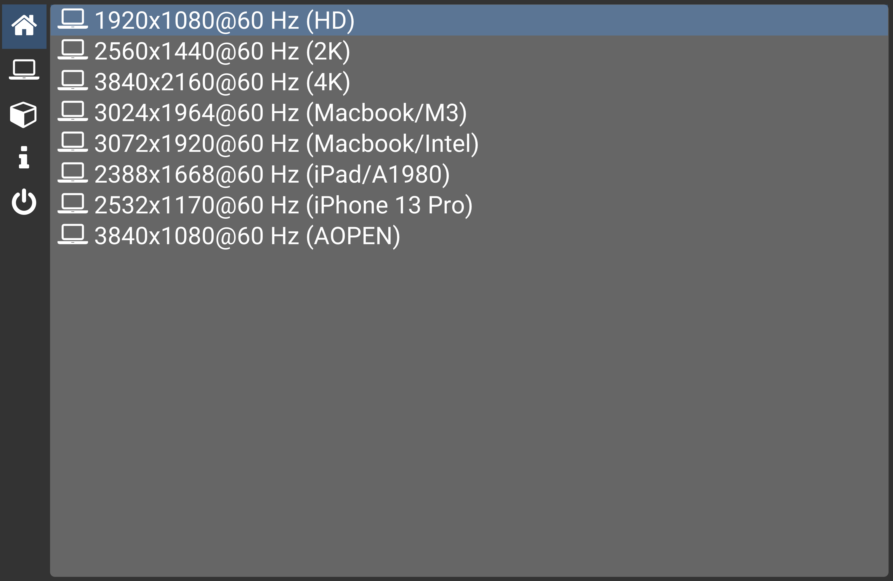
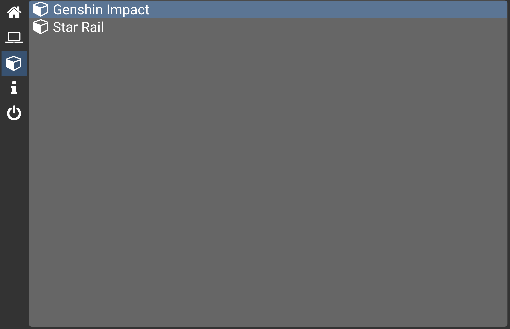
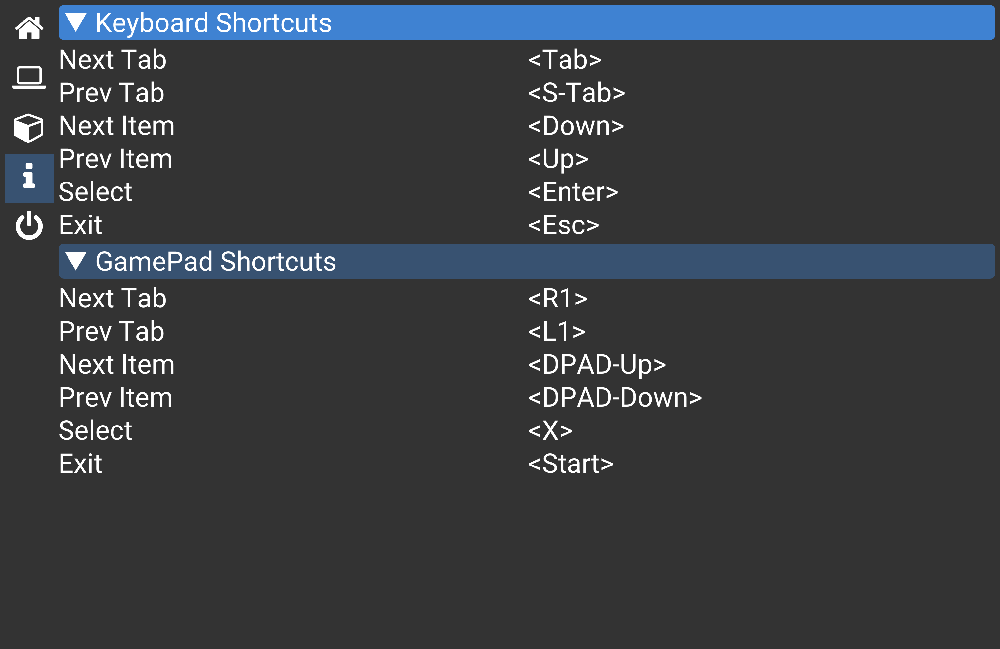

Moonlight-Launcher
==================

This is a simple launcher for sunshine/moonlight streaming services.

It is initially created to dynamically adjusting Windows desktop resolution and scale.
It is created to facilitate my daily use cases because I have multiple devices with different
screen sizes. Every time I start streaming, I will need to adjust the desktop resolution and DPI scaling.
Therefore I wrote this software to allow me to choose resolution on start.

Later on, I added additional features to launch applications with script, which is inspired by Playnite,
a more publicly known game launcher.

Since this tool is created to be used on both PC and TV, inputs from mouse/keyboard/gamepads are all supported.

Note that both resolutions and applications are configurable.
During the first launch, a default configuration file will be stored at
```
~/AppData/Roaming/Moonlight-Launcher/moonlight-launcher.toml
```
Users can modify the toml configuration file.

Features
--------
1. switch display resolution and scaling
2. launch applications with batch scripts
3. mouse/keyboard/gamepad support
4. configurability

Screenshots
-----------




Author(s)
---------
[Tianyu Cheng](tianyu.cheng@utexas.edu)
